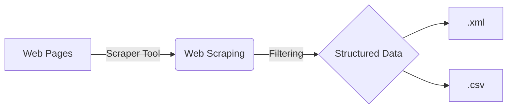

# Bosphorus Web Api Project  

Bu proje, web scraping tekniği kullanarak web sitelerinden halka açık verileri kazıma ve işleme yöntemlerini uygulayarak bilgi yayılımının özgürleştirilmesini amaçlamaktadır.

_Projeye Doğrudan Ulaşmak ve Satın Almak İçin Ziyaret Edebilirsiniz: [Turkish News Api](https://rapidapi.com/mkesim/api/turkish-news1)_

## Web Scraping(Web Kazıma) Nedir?

Web Scraping, özel bir yazılım aracılığıyla web sitelerinden veri toplayarak son kullanıcıya ulaştıran program tekniğidir.

> ### _Akış Diyagramı:_

> ### _UML Sınıf Diyagramı:_

_Daha fazla bilgi için ziyaret edebilirsiniz: [Vikipedi/Web Scraping](https://tr.wikipedia.org/wiki/Web_kaz%C4%B1ma)._

## Yasal Durumlar

Web Scraping ile ilgili mevcut durumda herhangi bir yasal düzenleme veya kanun bulunmamaktadır. Çoğu yeni girişim, herhangi bir ortaklık gerektirmediğinden ve ucuz olduğundan dolayı veri toplamak için bu yöntemi kullanmaktadır.

_Daha fazla bilgi için ziyaret edebilirsiniz: [Legality and Ethics of Web Scraping](https://www.researchgate.net/publication/352014123_Legality_and_Ethics_of_Web_Scraping)._

